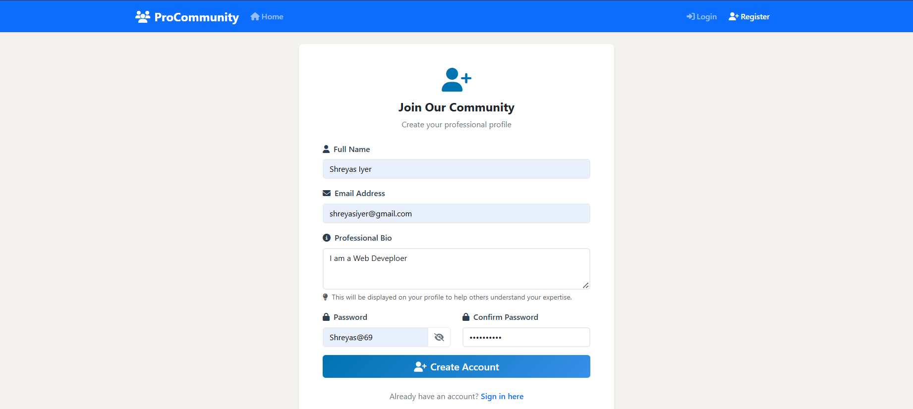
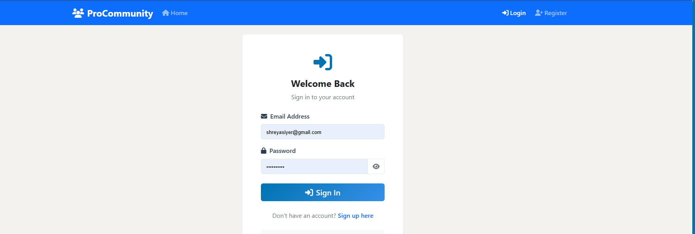
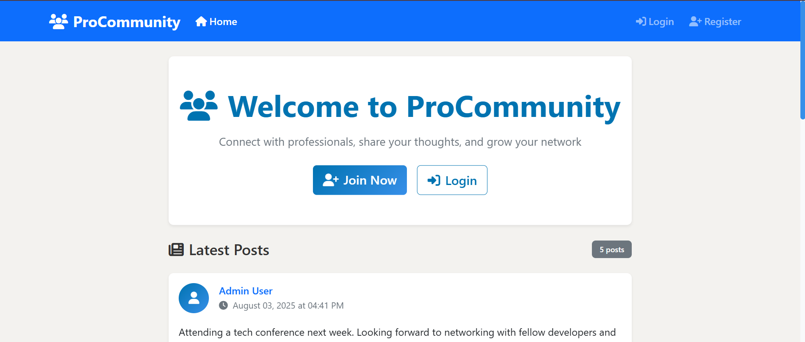
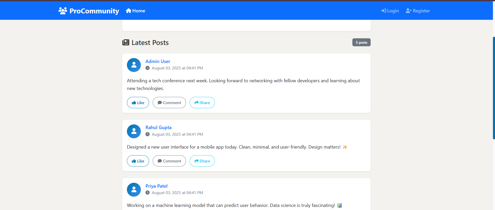
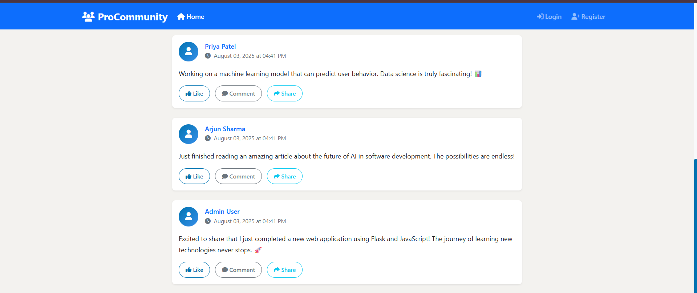
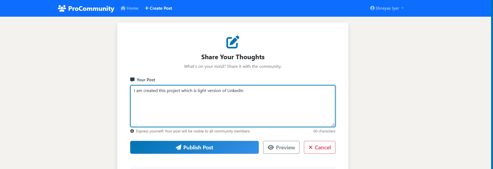
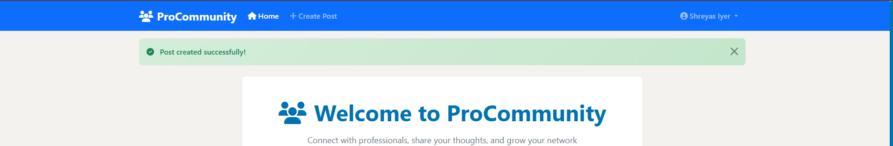
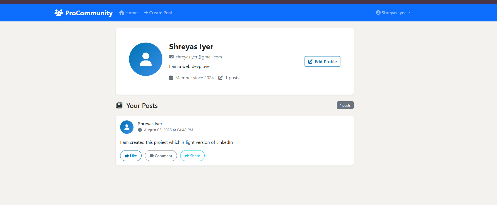

# ProCommunity

ProCommunity is a lightweight professional networking web app built with Flask. Think of it as a mini version of LinkedIn — where users can sign up, log in, create posts, and view others' posts in a clean, modern feed. It’s designed to help professionals connect, share insights, and showcase their profiles.

---

## 🔍 Key Features

- 👤 **User Authentication** – Secure login and signup using password hashing.
- 🧾 **Create & View Posts** – Share posts that appear on a community feed.
- 🪪 **Profile Management** – Update your name, bio, and see your personal posts.
- 🖼️ **Responsive UI** – Styled using Bootstrap 5 with a clean, professional layout.
- 🔐 **Session Management** – Keeps users logged in securely.

---

## 🧱 System Architecture

### ⚙️ Frontend

- **Template Engine**: Jinja2 with Flask
- **CSS Framework**: Bootstrap 5 for a responsive and mobile-friendly layout
- **Icons**: Font Awesome 6
- **JS**: Vanilla JavaScript for interactivity
- **Custom Styling**: Professionally themed CSS inspired by LinkedIn

### 🧠 Backend

- **Framework**: Flask (Python)
- **Authentication**: Passwords hashed using Werkzeug utilities
- **Session Management**: Built-in Flask session with secret key
- **Data Handling**: Temporary in-memory data using Python structures like dictionaries and lists — suitable for prototyping and quick iteration without the overhead of a full database

---

## 🗃️ Data Models

- **Users**
  - `name`
  - `email`
  - `bio`
  - `hashed password`

- **Posts**
  - `content`
  - `author`
  - `timestamp`
  - `post_id`

Sample user data includes mock Indian professional names for local flavor and demo testing.

---

## 🌐 Route Structure

| Route           | Description                         |
|------------------|-------------------------------------|
| `/`              | Home feed with all posts            |
| `/login`         | Sign in page                        |
| `/signup`        | User registration page             |
| `/logout`        | Logs the user out                   |
| `/create`        | Create a new post                   |
| `/profile/<id>`  | View or edit user profile           |

---

## 🧩 Design Patterns

- **MVC Pattern** – Flask routes as controllers, templates as views, in-memory lists as models
- **Template Inheritance** – Reusable base template for layout consistency
- **Component Reusability** – Modular code and styles

---

## 📦 Dependencies

### Python

- `Flask`
- `Werkzeug`
- `Logging`, `Datetime`, and other standard libraries

### Frontend

- Bootstrap 5 (via CDN)
- Font Awesome 6 (via CDN)

---

## 🧪 Development Tools & Practices

- Flask Debug Mode ON (during development)
- Environment variable `SESSION_SECRET` for securing sessions
- Static assets (CSS/JS) managed through Flask’s `/static/` folder
- Logging enabled for monitoring routes and app behavior

---

---

## 🖼️ Demo Screenshots

### 🔐 Signup

### 🔓 Signin

### 🏡 Home Feed (Initial)

### 🏡 Home Feed (Scroll)

### 🏡 Home Feed (More Scroll)

### 📝 Create a Post

### ✅ Post Created

### 👤 User Profile

---

## 🙌 Final Note

ProCommunity is still in its early stage — a prototype built to demonstrate core functionality. Future updates could include:

- Persistent database (e.g., SQLite or PostgreSQL)
- Profile image uploads
- Like, comment, and follow features
- REST API integration
- Hosting on a cloud platform

## ✨ Planned Features

- [ ] Persistent database (SQLite or PostgreSQL)
- [ ] Profile image uploads
- [ ] Like, comment, and follow functionality
- [ ] REST API endpoints
- [ ] Email verification
- [ ] Deployment on platforms like Render or Vercel

---

## 📌 Notes

This is a working MVP submitted within the 48-hour timeline.  
Core features have been implemented and demonstrated with screenshots above.  
Database integration and hosting are scheduled for future updates.

---

Stay tuned! 🎯
